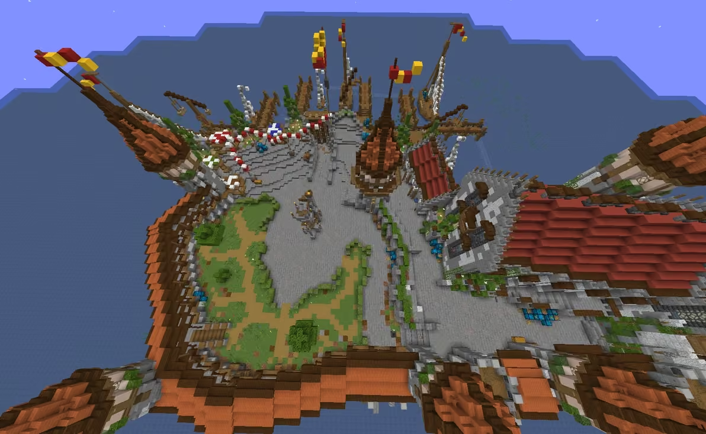
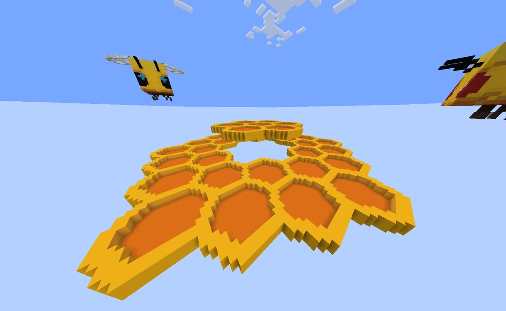
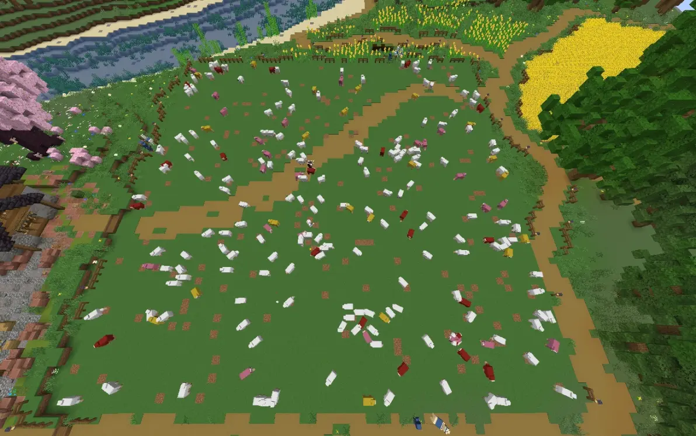
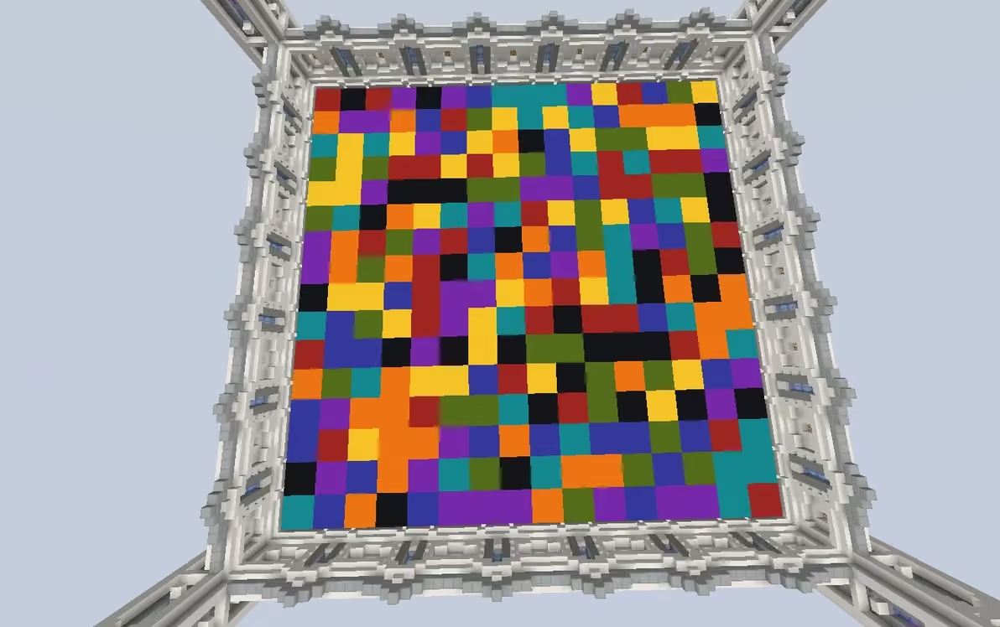
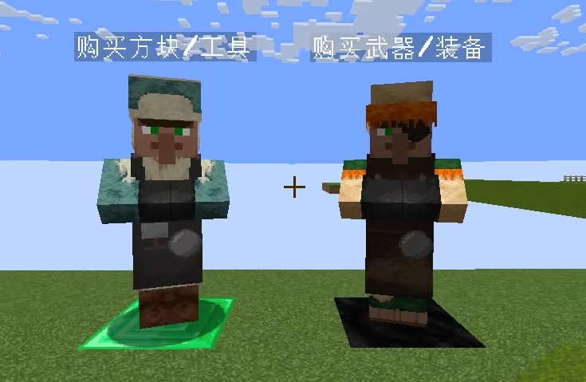
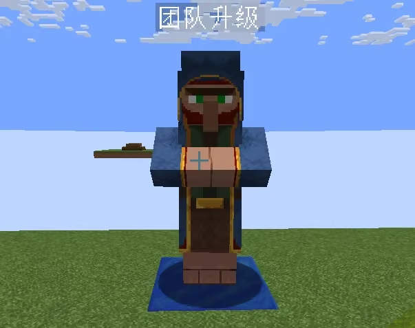

在游玩小游戏之前，建议先阅读本教程了解游戏内容及玩法，以便更好发挥。

 **服务器特殊玩法** ：小游戏竞赛，工作日每晚18:00 - 22:00，周末12:00-23:00每隔一小时举办一场，在下列游戏中随机抽取一个。参与即可获得一定金币（自动加入，如不想参与需要在服务器新菜单中按辅助功能菜单-功能选项-找到不参与小游戏相关并勾选)

前往小游戏岛屿指令：**/visit island [岛屿编号]**

## **射箭小游戏(#56188)**

**获胜方法：存活到最后**

**游戏道具：开局时，发放随机附魔弓及护甲。开局约15秒后，每隔5秒发放箭，光灵箭，瞬间伤害箭，剧毒之箭，迟缓之箭，金苹果中的一种。**

特殊机制：

每一局都有一定概率触发特殊事件。

每一次击败玩家，都会使弓的力量附魔+2，无上限。

## **击击棒小游戏（#56187）**

### **获胜方法：存活到最后**

**游戏道具：开始时，发放击退10木棍，4颗末影珍珠。开局后每30（+60s，+120s以此类推）秒，发放击退15的烈焰棒。开局每60（+60s，+120s以此类推）秒，发放击退20的烈焰棒以及一颗末影珍珠。注意：烈焰棒在使用一次后会消失。**

游戏开始后，将玩家击落虚空即可击败对方。

## **天天酷跑小游戏(#56282)**

### **获胜方式：存活到最后**

**游戏道具：无**

开局后，玩家有10秒准备时间，随后玩家所站羊毛将会变色，每1秒变化一次颜色。

方块安全程度从左向右依次为：白色-黄色-橙色-红色-消失。

## **消失的羊毛小游戏（#56279）**

### **获胜方式：存活到最后**

**游戏道具：无**

开局后，站到安全的方块上，游戏区域内的羊毛每2秒会被随机选择并变色，变化顺序：白-黄-橙-红-消失。

## **黄金矿工小游戏（#56192）**

### **获胜方式：积分榜最高**

**游戏道具：自行制作镐**

游戏时长7分钟，场地的第一层为草方块，第二层为原木，第三层开始会刷新石头及各种矿物，最底层为基岩。用镐采集矿物获得积分。

矿物对应的分数：煤1分；铁3分；金15分；钻石50分；绿宝石100分

矿物的特殊效果：红石：给予15秒急迫效果；青金石：镐效率附魔+1，无上限

## **剪羊毛小游戏(#56099)**

### **获胜方式：积分榜最高**

**游戏道具：剪刀**

游戏时长3分钟，开局后，场地内会刷新不同积分及效果的羊，使用剪刀剪掉羊毛即可获得对应积分和效果。

不同颜色的羊对应效果及积分： **白色羊：积分+1** ； **粉红羊：积分+5** ； **黄色羊：获得15s迅捷II并且积分+3** ； **红色羊：产生爆炸，可以对周围羊和玩家造成伤害，你的积分-15** 。

## **掘一死战小游戏（#1634）**

### **获胜方式：存活到最后**

**游戏道具：效率5附魔的下界合金铲以及4组雪球(64堆叠)。**

特殊机制：铲子可以对玩家造成伤害，也可以用于挖掘玩家脚下雪块。

雪球可用于丢脚下雪块，被雪球丢到的雪块会消失。玩家掉落平台即视为出局。

## **烫手山芋小游戏（#43893）**

### **获胜方式：存活到最后**

**游戏道具：山芋（类型为：TNT，苦力怕，闪电苦力怕）**

开局后，玩家会有约30秒时间寻找合适位置

倒数五秒后山芋会被随机放置到玩家头顶，右键或攻击另一名玩家可将山芋交给ta，交出后会获得1秒迅捷5。

山芋被放置10秒后会爆炸，爆炸可以对其他玩家造成伤害，也会对地形造成破坏。

山芋爆炸后8秒会再次随机选择一名玩家放置山芋。

## **颜色匹配小游戏（#1364）**

### **获胜方式：存活到最后**

### **游戏道具：无**

游戏开始时，玩家快捷栏中会显示安全方块的颜色，站在安全方块上即可。

首轮倒数为8秒，随后会逐渐加快，最快为1秒，方块消失后约6秒会刷新下一次安全方块的颜色。

游戏进行一定伦茨后，将会允许攻击玩家，掉出场地即视为出局。

## **起床战争（#59054）**

### **获胜方式：摧毁所有敌方队伍的床并击杀所有队员**

### **游戏道具：木剑+全套无附魔皮革甲，可在出生岛屿商人处升级装备**

出生岛屿的铁块上会刷新铁锭和金锭，铁锭每次刷新4个，金锭每次刷新1个（铁锭刷新两次才会刷一次金锭）

资源数量限制：

玩家出生岛铁锭刷新达到2组，金锭达到32个，中心岛下界合金锭达到4个，边角岛屿钻石刷新达到8个后会停止刷新，被拾取后继续刷新
