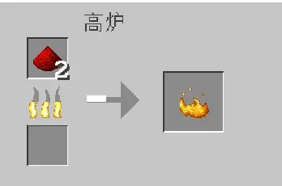
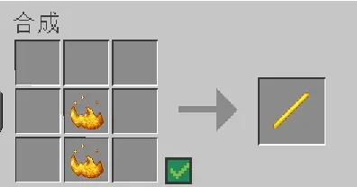

# **本教程会经常更新，旨在解答玩家高频率提问的问题。**

**如果只想查看某个问题的答案，可以通过目录检索**

### **Q: 我想跟朋友一起玩，该怎么去他的岛？**

A: 如果你的好友在线，使用指令/land tp [好友名]即可传送到他目前所在的岛。如果不在线，则使用指令/player [好友名]查看他的所有岛屿然后选择想要去的岛，点击即可。好友将你添加为岛屿成员需要他输入/member add [你的ID]，确认即可。

### **Q: 我去了别人的岛/变成了旁观者，该怎么回到自己的岛？**

A: 使用指令/is 即可。

### **Q: 如何获取海洋之心（本服唯一高级货币）？**

A: 1. 每月1号固定刷新一次(指令/bithexgem free)&nbsp;

2. mcmod评分(https://txc.qq.com/products/414594/faqs-more?id=154229) (根据评论质量发放海洋之心,上限两颗)
3. 每月雕塑/地图画(https://txc.qq.com/products/414594/faqs-more?id=154228) (根据地图画/雕塑质量(详细请询问chefu123)发放海洋之心,上限三颗)
4. 不定时举办的活动&nbsp;
5. 为其他玩家建造机器/向其他玩家购买(玩家间交易，风险自行承担)&nbsp;
6. 群内签到(概率为6%(0-59))&nbsp;
7. 花费金币购买(金币可通过/shop sell出售物品&小游戏活动&群游戏&完成任务(/challenge gui)获取)(指令/bithexgem buy)当月每购买一次下一次花费金币翻倍
8. 游玩文字游戏获得,频道内输入**/农场 帮助**或者**/钓鱼 帮助**来查看指令列表，**农场**每天每个作物有10%概率成为幸运作物，收获该作物有概率获得一颗海洋之心 **钓鱼**可以通过助力其他人获取金币和钓竿经验
9. 为梦幻之屿的bilibili宣传视频投放推广，每获得300播放量可获取一颗海洋之心(需要订单截图以及订单号)

10.为梦幻之屿制作宣传视频并发布，单视频每获得1000播放量可获得一颗海洋之心(需要视频链接，上限十个)

### **Q: 海洋之心有什么用途?**

A: 1. 开启新的岛屿

2. 将所在岛屿置于广告位
3. 升级neeko
4. 提升视距(初始为10区块)
5. 开启特殊结构
6. 开启全岛防火
7. 开启防幻翼
8. 开启全岛信标效果
9. 岛屿发射器功能拓展(暂不可用)
10. 开启私人smp(将16个海洋之心通过邮件寄给Molean(暂不可开启))
11. 与玩家交易(不禁止但不推荐, 风险自行承担)

### **Q: 任务/商店怎么打开？**

A: 打开任务的指令为/quest open，商店（仅可出售物品获取金币，不提供物品购买）/shop sell

### **Q: 这个服禁高频/红石吗？**

A: 没有任何限制，甚至你把自己游戏卡崩了别人也不会受影响。但尽量不要建造远超所需材料的刷怪塔，高网络占用可能会导致当前线路和其他玩家卡顿。如必须建造，请在挂机时减少发包(/assist reduceentitypacket 99)，此项仅减少服务器对客户端发包，不会影响机器运作，挂机结束时输入指令(/assist reduceentitypacket 0)即可恢复正常发包。

### **Q: 我该怎么在公屏说话/群内签到?**

A: 在群内验证即可，指令@古明地觉 /bind [player]。群号824852529 。

### **Q: 服务器怎么挂假人？**

A: 服务器禁止使用任何形式的假人，如有需要，请用小号

### **Q:鞘翅有哪些获得方式？**

A: 1. 苦力怕论坛顶贴

2. 岛屿末地钓鱼，1/66666概率钓出鞘翅，每位玩家限一次，可受海之眷顾影响
3. 潜影贝导弹击杀幻翼，1%概率掉落鞘翅，可无限获取
4. 向游戏内玩家请求帮助

### **Q: 如何获得大量红石？**

A: 新玩家初始红石粉可以通过刷怪塔击杀女巫掉落，服务器内大部分主世界群系都会以5的权重，每次生成一只女巫。获得红石粉后可以用高炉将红石粉转化为烈焰粉（此为服务器特殊合成表，可通过指令/menu recipe查看）

获得两个烈焰粉后可以合成烈焰棒（此为服务器特殊合成表，可通过指令/menu recipe查看）

获得烈焰棒后可以合成炼药台，村民绑定后即可使用绿宝石与之交换红石

可以花费海洋之心获得将岛屿内部分区域设置为女巫小屋结构的权限（主手拿箭左键和右键选区，然后使用指令/regionstructure add SWAMP_HUT）

### **Q: 服务器有哪些与原版不同的特性？**

A: 所有与原版不同的特性均被整合，使用指令/menu feature查看(该指令内容有较长时间未更新，内容不一定准确)

### **Q: 服务器的金币有什么用？怎么获得？**

A：目前金币有两个用途，第一个为购买海洋之心(不可交易)，每月第一个需要花费10000金币，下一次购买所需金币翻倍，指令为/bithexgem buy。第二个为解锁粘液科技的机器(所需金币的量大约为53万，不适合新玩家尝试)

金币获取有以下七个渠道：

1. 群内签到，从60-999随机获得(每日一次，连签会提高获得的金币)
2. 参与服务器的小游戏，排名越高获得金币数量越多(获取量取决于参与游戏的人数)
3. 出售物品，指令为/shop sell，随着出售物品增多获取金币会下降
4. 游玩群游戏(目前有钓鱼和农场两个群游戏，群号818016718)
5. 前往极限生存岛屿完成任务(前往该岛屿指令为: /visit id 62917)(大约可获取10w)
6. 完成空岛挑战/每日任务(打开该面板指令为: /quest open)(该面板仅1.21.6及以上玩家可以打开，低于该版本会断开服务器连接)
7. 在苦力怕论坛为服务器限时提升/高亮，每花费1铁粒可获得33金币

### **Q: 服务器有末地吗？怎么去？**

A: 服务器中每个岛屿都有末地，制作末影之眼并跟随末影之眼漂浮的方向，当末影之眼到达末地门附近时，末地门框架会自动出现，填入末影之眼即可。如破框架时误将末地门顶掉，再丢一颗末影之眼，框架即可重新生成。

### **Q: 每天晚上都会自动被拉进服务器的小游戏活动，如何才能不自动加入？**

A: 在新版服务器菜单中(默认按G打开，需要1.21.6+)，按辅助功能菜单-功能选项-下拉找到不参与小游戏相关内容，勾选后确认即可。

### **Q: 我的下界/末地建造的东西不见了，怎么办?（此问题仅针对回服老玩家，新玩家可以忽略）**

A: 如果下界建筑消失，输入指令/teleportationscaleset 1

末地建筑消失，输入指令/togglerelocateendportal

**注意输入指令时需要在主世界**

### **Q: 服务器可以使用刷线机吗？**

A: 在Java1.21.2的更新中，mojang修复了刷线机的bug，服务器当前版本为26.1.2故无法使用

### **Q: 死亡掉落吗**

死亡会掉落物品，但是掉入虚空的物品可以/recycle mine拾回。

### **Q: 服务器开多久了**

梦幻之屿起源于2015年7月。空岛服从2020年5月开放至今，从未删档。

### **Q: 有主城吗**

无。

梦幻之屿岛屿特色系统始终以化繁为简为设计理念。把复杂的事情变简单，让玩家专注于游戏内容本身。

梦幻之屿没有主城，也不提供任何系统建筑，没有创建岛屿的过程，进入服务器即开始游戏。梦幻之屿就是一个纯粹到不能再纯粹的空岛生存服务器，除了空岛，那就什么也没有了。

除此之外，在游戏实际过程中，你会发现这一理念贯穿整个服务器设计。

### **Q: 服务器有哪些修改**

在游戏内输入/menu feature
